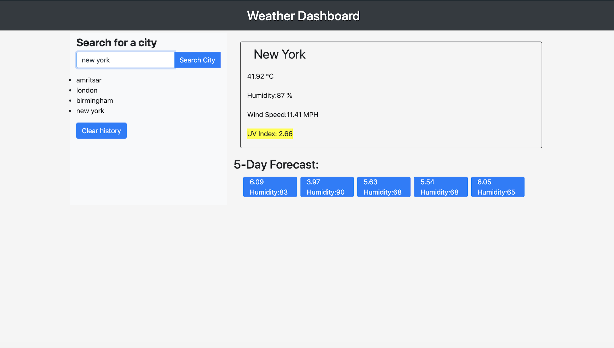

### Website Title and Description

## Server-Side APIs: Weather Dashboard

Weather Dashboard: 
This project is a weather dashboard with search functionality to find current weather conditions and forecasted weather for cities all over the world. 
It uses the OpenWeather API to retrieve data for the cities, AJAX to hook into the API to retrieve the data in JSON format, 
dynamically updated HTML and CSS powered by jQuery, 
and displays a search history which the user can click to access past cities searched via local storage.

# How to access?
The website can be found at the following address:
https://nikstar-1.github.io/weather-dashboard/

# Motivation
As someone who travels frequently this'll help me plan adventures away according to weather conditions,
I'll never forget my brolly again!

## Functionality
-Input a city, 

-Dashboards will then display the current weather for a city

-Plus, a 5 day forecast for current weather searched initially

-Weather conditions, temperature, humidity, wind speed, and the UV index results shown

-units=imperial", "&units=metric" applied i.e °C, %, MPH, UV index

-Saves your search into a search history, you can go back if needed!

-Refresh to start a new search

## Built With
HTML

CSS

Openweathermap api

Javascript

Bootstrap

moment.js

## Screenshots:

**Weather Dashboard Main.**

_________________________________________________________________________________________________________________________________________________________________________________

###06 Server-Side APIs: Weather Dashboard
Developers are often tasked with retrieving data from another application's API and using it in the context of their own. 
Third-party APIs allow developers to access their data and functionality by making requests with specific parameters to a URL. 
Your challenge is to build a weather dashboard that will run in the browser and feature dynamically updated HTML and CSS.
Use the OpenWeather API to retrieve weather data for cities. 
The documentation includes a section called "How to start" that will provide basic setup and usage instructions. Use localStorage to store any persistent data.

User Story
AS A traveler
I WANT to see the weather outlook for multiple cities
SO THAT I can plan a trip accordingly

##Acceptance Criteria
GIVEN a weather dashboard with form inputs
WHEN I search for a city
THEN I am presented with current and future conditions for that city and that city is added to the search history
WHEN I view current weather conditions for that city
THEN I am presented with the city name, the date, an icon representation of weather conditions, the temperature, the humidity, the wind speed, and the UV index
WHEN I view the UV index
THEN I am presented with a color that indicates whether the conditions are favorable, moderate, or severe
WHEN I view future weather conditions for that city
THEN I am presented with a 5-day forecast that displays the date, an icon representation of weather conditions, the temperature, and the humidity
WHEN I click on a city in the search history
THEN I am again presented with current and future conditions for that city
WHEN I open the weather dashboard
THEN I am presented with the last searched city forecast
The following image demonstrates the application functionality:

Review
You are required to submit the following for review:

The URL of the deployed application.

The URL of the GitHub repository. Give the repository a unique name and include a README describing the project.

© 2019 Trilogy Education Services, a 2U, Inc. brand. All Rights Reserved.